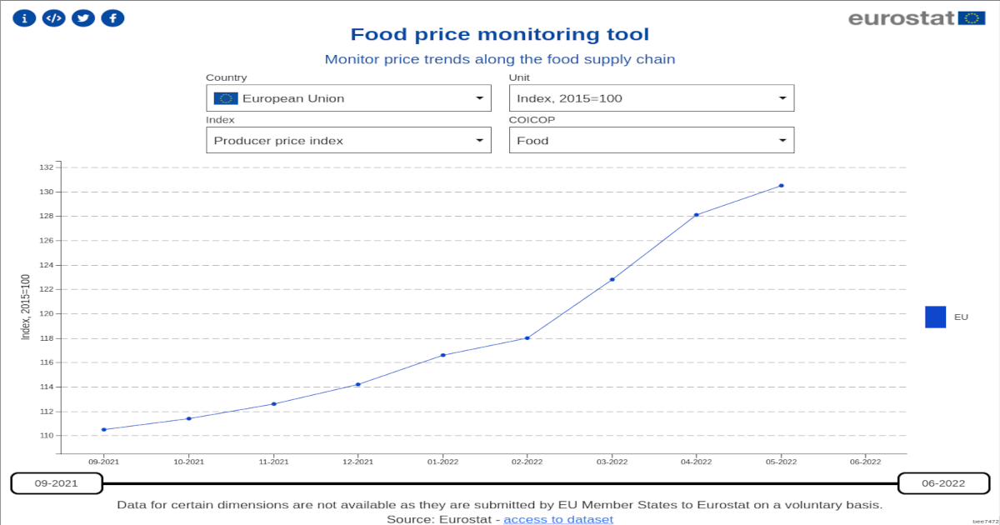

# how to run

    git clone https://github.com/kaukana0/tool-foodPriceMonitoring.git
    cd tool-foodPriceMonitoring/
    git submodule init
    git submodule update
    cd app ; python3 -m http.server 9000

- this gets the sources (dependencies are included as redistributables)
- then, each component is being downloaded as a submodule 
    - for each a certain commit, specified by this repo
- the app can now be served w/ a http server

# how to deploy

1. ./make-deployment.sh
2. copy dist/ to webserver
3. profit

# what it looks like

